# movie_recommendation_pyspark
Desenvolvendo uma engine de recomendação de filmes com ALS - PySpark

## Índice
- Descrição da base de dados
- Tecnologias utilizadas
- Desafios do projeto
- Armazenamento dos dados no HDFS
- Análise de dados dos filmes
- Implementação do algoritmo ALS

## Descrição da base de dados
A base de dados ml-latest descreve a atividade de classificação de 5 estrelas e aplicação de tags de texto livre do MovieLens, um serviço de recomendação de filmes. Ela contém **33.832.162 classificações** e **2.328.315 aplicações de tags em 86.537 filmes**. Esses dados foram criados por **330.975 usuários** entre 9 de janeiro de 1995 e 20 de julho de 2023. A base de dados foi gerada em 20 de julho de 2023.

A base de dados inclui arquivos como `ratings.csv`, `tags.csv`, `movies.csv`, `links.csv`, `genome-scores.csv` e `genome-tags.csv`. Ela também contém informações sobre a estrutura dos arquivos, como os formatos de dados e as condições de uso.

Além disso, a base de dados ml-latest é uma base de desenvolvimento e não é apropriada para resultados de pesquisa compartilhados. Ela está disponível para download público, mas seu uso está sujeito a condições específicas, incluindo a necessidade de citar a base de dados em publicações resultantes do seu uso.

- **ratings.csv (33.8 mi):** Este arquivo contém todas as classificações na base de dados. Cada linha representa uma classificação de um filme por um usuário e tem o seguinte formato: userId, movieId, rating, timestamp. As classificações são feitas em uma escala de 5 estrelas, com incrementos de meio ponto (0,5 estrelas - 5,0 estrelas).

- **tags.csv (2.32 mi):** Este arquivo contém todas as tags na base de dados. Cada linha representa uma tag aplicada a um filme por um usuário e tem o seguinte formato: userId, movieId, tag, timestamp. As tags são metadados gerados pelo usuário sobre filmes e geralmente consistem em uma única palavra ou frase curta.

- **movies.csv (86537 mil):** Este arquivo contém informações sobre os filmes na base de dados. Cada linha após a linha de cabeçalho representa um filme e tem o seguinte formato: movieId, title, genres. Os títulos dos filmes incluem o ano de lançamento entre parênteses. Os gêneros são uma lista separada por tubos e são selecionados de uma lista específica.

- **links.csv (86537 mil):** Este arquivo contém identificadores que podem ser usados para vincular a outras fontes de dados de filmes. Cada linha após a linha de cabeçalho representa um filme e tem o seguinte formato: movieId, imdbId, tmdbId. Os identificadores são usados por diferentes provedores de dados de filmes, como MovieLens, IMDb e The Movie Database (TMDb).

- **genome-scores.csv (18.4 mi):** Este arquivo contém dados de relevância de tags para filmes. Cada linha representa a relevância de uma tag para um filme e tem o seguinte formato: movieId, tagId, relevance. Esses dados fazem parte do Tag Genome, que codifica quão fortemente os filmes exibem propriedades específicas representadas por tags.

- **genome-tags.csv (1128 mil):** Este arquivo fornece descrições de tags para os IDs de tags no arquivo do Tag Genome. Cada linha após a linha de cabeçalho tem o seguinte formato: tagId, tag. Os valores de tagId são gerados quando o conjunto de dados é exportado, então eles podem variar de uma versão para outra dos conjuntos de dados do MovieLens.

## Tecnologias utilizadas

### HDFS - Hadoop Distributed File System
O HDFS, ou Hadoop Distributed File System, é um sistema de arquivos distribuído desenvolvido para lidar com o armazenamento e processamento eficientes de grandes conjuntos de dados em ambientes de computação distribuída. Projetado como parte integrante do ecossistema Hadoop, o HDFS divide arquivos em blocos de tamanho fixo, distribuindo-os em diversos nós de um cluster. Essa abordagem facilita a leitura e gravação paralelas, possibilitando o processamento eficiente de dados em larga escala. Com mecanismos de replicação para tolerância a falhas, balanceamento dinâmico de carga e integração com ferramentas Hadoop, o HDFS é essencial para operações de big data, suportando aplicações como análise de dados, processamento de logs e outras tarefas intensivas em armazenamento e processamento.

1. **Blocos e Distribuição de Dados:** O HDFS divide grandes arquivos em blocos, geralmente de tamanho fixo (por exemplo, 128 MB ou 256 MB).
2. **Servidores Namenode e Datanode:**
   - O Namenode mantém os metadados, como informações sobre a localização dos blocos e a estrutura do arquivo.
   - Os Datanodes armazenam os blocos de dados e respondem às solicitações de leitura e gravação.
3. **Leitura e Gravação em Paralelo:**
   - O HDFS permite a leitura e gravação eficientes de grandes conjuntos de dados em paralelo.
   - Múltiplos nós podem acessar e processar diferentes partes do arquivo simultaneamente.

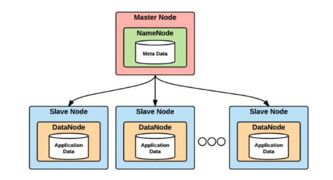</img>

### Hive
O Apache Hive é um software de data warehouse de código aberto projetado para ler, gravar e gerenciar grandes conjuntos de dados extraídos do Apache Hadoop Distributed File System (HDFS), um aspecto de um ecossistema Hadoop maior.

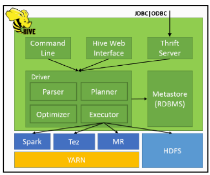</img>

### Pyspark
PySpark é uma API em Python para executar o Spark e foi lançado para oferecer suporte à colaboração entre Apache Spark e Python. O PySpark também oferece suporte à interface do Apache Spark com conjuntos de dados distribuídos resilientes (RDDs) na linguagem de programação Python. Isso é obtido aproveitando a biblioteca Py4J.

#### PySparkSQL
PySparkSQL é uma biblioteca PySpark para análises semelhantes a SQL em grandes quantidades de dados estruturados e semiestruturados. Você pode usar o PySparkSQL para executar queries SQL, trabalhar com o Apache Hive e até mesmo aplicar o HiveQL.

#### MLlib
MLlib é um wrapper para PySpark e a biblioteca de machine learning (ML) do Spark. Esta biblioteca usa a técnica de paralelismo de dados para armazenar e trabalhar com dados. A API de machine learning fornecida pela biblioteca MLlib é fácil de usar. MLlib é compatível com muitos algoritmos de machine learning para classificação, regressão, agrupamento, filtragem colaborativa, redução de dimensionalidade e primitivas de otimização subjacentes.

### ALS - Alternating Least Squares
O ALS (Alternating Least Squares) em PySpark é um algoritmo de fatoração de matrizes utilizado para sistemas de recomendação. Ele opera através de iterações, aproximando a matriz de classificações R como o produto de duas matrizes inferiores, X e Y. A abordagem iterativa envolve a constante resolução de uma matriz enquanto a outra é mantida fixa. Esta implementação específica utiliza uma abordagem bloqueada, otimizando a comunicação entre conjuntos de fatores ('usuários' e 'itens') por meio de blocos. O ALS é eficaz para dados de preferências implícitas, adaptando-se a uma matriz de preferência P, onde os elementos indicam confiança na preferência do usuário. Em resumo, o ALS é uma ferramenta fundamental para construção de sistemas de recomendação, proporcionando uma abordagem eficiente e escalável para encontrar padrões em grandes conjuntos de dados.

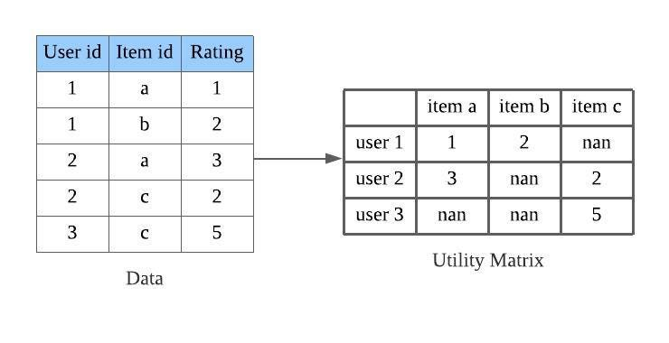</img>

## Desafios do projeto
- **Configuração do ecossistema Hadoop:** Embora não seja o foco do projeto em si, mas a configuração do ecossistema Hadoop localmente foi de enorme aprendizado para mim por se tratar de um mundo novo com diversas ferramentas e conceitos que tendem a se expandir conforme os anos por conta da necessidade de BigData nas grandes corporações. Vale destacar que todo o passo a passo de configuração foi elaborado pelo (Curso de construção de Big Data com Cluster de Hadoop e Ecossistema)[https://www.udemy.com/course/construindo-big-data-com-cluster-de-hadoop-e-ecossistema/].
- **Configuração inicial do PySpark com Hive:** A configuração inicial para acessar o Hive através do PySpark foi desafiadora por conta da inexperiência nesse tipo de conexão. Encontrar fontes na web para solucionar os problemas que eu estava enfrentando não foi trivial, mas, após a conexão ser realizada com sucesso, ficou fácil compreender todos os parâmetros de configuração necessários para realizar a conexão do Pyspark com o Hive.
- **Uso de memória RAM:** Por conta do processamento em memória do PySpark, a hiperparamêtrização do modelo foi bastante custoso para o meu PC de 16GB RAM que estava executando o Pyspark e mantendo o Hadoop ativo com 5 máquinas virtuais ativas. Foi necessário alterar uma configuração do PySpark alterando o uso de memória para 12GB no arquivo `%SPARK_HOME%\conf\spark-defaults.conf`

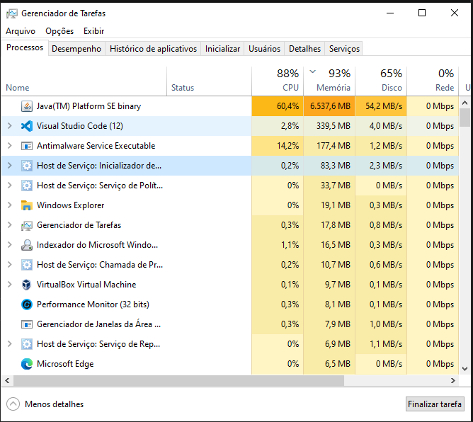</img>
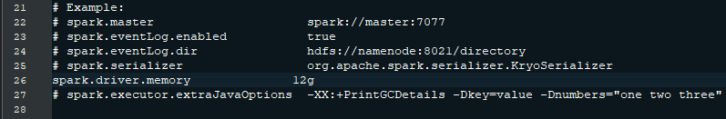</img>

<p style="color: blue"><b>TODO</b></p>

## Armazenamento dos dados no HDFS
### Explicando brevemente meu ecossistema Hadoop
O ecossistema Hadoop do projeto consiste em três master nodes (m1, m2, m3) e dois slave nodes (s1, s2). Cada nó tem funções específicas dentro do ecossistema. Abaixo estão as principais componentes e funções de cada nó:

```bash
m1: 1445 NameNode
m1: 1971 ResourceManager
m1: 2420 JobHistoryServer
m1: 2624 QuorumPeerMain
m1: 2762 RunJar
m1: 2763 RunJar
m1: 3107 RunJar
m1: 3579 Jps
m2: 1214 SecondaryNameNode
m2: 1317 QuorumPeerMain
m2: 1603 Jps
m3: 1244 QuorumPeerMain
m3: 1381 Jps
s1: 1169 DataNode
s1: 1287 NodeManager
s1: 1492 Jps
s2: 1173 DataNode
s2: 1291 NodeManager
s2: 1493 Jps
```

**Master Nodes (m1, m2, m3)**
> **m1**
> - ResourceManager Gerencia recursos e programação de trabalhos no cluster.
> - JobHistoryServer Armazena logs de histórico de jobs.
> - QuorumPeerMain Coordenação de configurações distribuídas.

> **m2**
> - SecondaryNameNode Ajuda o NameNode em tarefas de backup.
> - QuorumPeerMain Coordenação de configurações distribuídas.

> **m3**
> - QuorumPeerMain Coordenação de configurações distribuídas.


**Slave Nodes (s1, s2)**
> **s1**
> - DataNode: Armazenamento de dados no HDFS.
> - NodeManager: Gerencia recursos no nó para execução de tarefas.

> **s2**
> - DataNode: Armazenamento de dados no HDFS.
> - NodeManager: Gerencia recursos no nó para execução de tarefas.

### Criando tabelas temporárias
Quando utilizarmos o comando LOAD, usaremos o OpenCSVSerde, um SerDe projetado para ler arquivos CSV. SerDe trata-se de uma abreviação para Serializer/Deserializer. O Hive usa a interface SerDe para ler e escrever dados em qualquer formato customizado. OpenCSVSerde trata todas as colunas como String, então irei criar tabelas temporárias e carregar dados nessas tabelas utilizando o OpenCSVSerde, para então converter as colunas das tabelas para os tipos de dados adequados.

```sql
-- Comando LOAD utilizando OpenCSVSerde para ler arquivos CSV.
-- OpenCSVSerde é um SerDe projetado para processar arquivos CSV.

-- Criar tabelas temporárias usando OpenCSVSerde.
CREATE TABLE ratings_tmp (
  userId STRING,
  movieId STRING,
  rating STRING,
  rating_timestamp STRING
) ROW FORMAT SERDE 'org.apache.hadoop.hive.serde2.OpenCSVSerde' TBLPROPERTIES ("skip.header.line.count"="1");

CREATE TABLE movies_tmp (
  movieId STRING,
  title STRING,
  genres STRING
) ROW FORMAT SERDE 'org.apache.hadoop.hive.serde2.OpenCSVSerde' TBLPROPERTIES ("skip.header.line.count"="1");

CREATE TABLE tags_tmp (
  userId  STRING,
  movieId STRING,
  tag     STRING,
  tag_timestamp STRING
) ROW FORMAT SERDE 'org.apache.hadoop.hive.serde2.OpenCSVSerde' TBLPROPERTIES ("skip.header.line.count"="1");

CREATE TABLE links_tmp (
   movieId STRING,
   imbdId  STRING,
   tmdbId  STRING
) ROW FORMAT SERDE 'org.apache.hadoop.hive.serde2.OpenCSVSerde' TBLPROPERTIES ("skip.header.line.count"="1");

CREATE TABLE links_tmp (
   movieId STRING,
   imbdId  STRING,
   tmdbId  STRING
) ROW FORMAT SERDE 'org.apache.hadoop.hive.serde2.OpenCSVSerde' TBLPROPERTIES ("skip.header.line.count"="1");

CREATE TABLE genome_tags_tmp (
   tagId STRING,
   tag   STRING
) ROW FORMAT SERDE 'org.apache.hadoop.hive.serde2.OpenCSVSerde' TBLPROPERTIES ("skip.header.line.count"="1");

CREATE TABLE genome_scores_tmp (
   movieId STRING,
   tagId   STRING,
   relevance   STRING
) ROW FORMAT SERDE 'org.apache.hadoop.hive.serde2.OpenCSVSerde' TBLPROPERTIES ("skip.header.line.count"="1");

-- Carregar dados nas tabelas temporárias usando OpenCSVSerde.
-- OpenCSVSerde trata todas as colunas como String.
-- Posteriormente, as colunas serão convertidas para os tipos de dados adequados.
```

### Carregando tabelas temporárias
```sql
-- Comandos para carregar dados em tabelas temporárias usando o comando LOAD DATA.
-- Carregar dados do arquivo local (não está no HDFS) na tabela temporária

LOAD DATA LOCAL INPATH '/tmp/ml-latest/ratings.csv' OVERWRITE INTO TABLE ratings_tmp;
LOAD DATA LOCAL INPATH '/tmp/ml-latest/movies.csv' OVERWRITE INTO TABLE movies_tmp;
LOAD DATA LOCAL INPATH '/tmp/ml-latest/tags.csv' OVERWRITE INTO TABLE tags_tmp;
LOAD DATA LOCAL INPATH '/tmp/ml-latest/links.csv' OVERWRITE INTO TABLE links_tmp;
LOAD DATA LOCAL INPATH '/tmp/ml-latest/genome-tags.csv' OVERWRITE INTO TABLE genome_tags_tmp;
LOAD DATA LOCAL INPATH '/tmp/ml-latest/genome-scores.csv' OVERWRITE INTO TABLE genome_scores_tmp;
```

### Carregando tabelas finais
Quando examinado os dados, notei que os títulos que contém o caractere vírgula possuem um erro interessante. Por exemplo: o título é armazenado como “American President, The (1995)” em vez de “The American President (1995)”. 

**Criando as tabelas**

Criação de tabelas armazenadas no formato ORC, utilizando dados da tabelas temporárias

```sql
CREATE TABLE movies STORED AS ORC 
AS 
SELECT 
  CAST(movieid AS BIGINT) AS movieid,  -- Converte a coluna 'movieid' para o tipo BIGINT.
  CASE 
    WHEN title LIKE '%, The %'
    THEN CONCAT('The ', regexp_replace(title, ', The ', ' '))  -- Adiciona "The " ao título que contém ", The ".
    ELSE title 
  END AS title,  -- Renomeia a coluna 'title'.
  CAST(regexp_extract(title, '\\((\\d{4})\\)', 1) AS INT) AS year,  -- Converte 'year' para inteiro.
  SPLIT(genres, '\\|') AS genres  -- Converte a coluna 'genres' para um array.
FROM 
  movies_tmp;
```

```sql
CREATE TABLE ratings STORED AS ORC 
AS 
SELECT 
  userid,  -- Mantém a coluna 'userid'.
  CAST(movieid AS BIGINT) AS movieid,  -- Converte a coluna 'movieid' para o tipo BIGINT.
  CAST(rating AS DECIMAL(10, 1)) AS rating,  -- Converte a coluna 'rating' para o tipo DECIMAL.
  CAST(rating_timestamp AS BIGINT) AS rating_timestamp,  -- Converte a coluna 'rating_timestamp' para o tipo BIGINT.
  to_utc_timestamp(from_unixtime(CAST(rating_timestamp AS BIGINT)), 'UTC') AS rating_date  -- Adiciona a coluna 'rating_date' convertendo 'rating_timestamp' para uma data.
FROM 
  ratings_tmp;
```

```sql
CREATE TABLE tags STORED AS ORC 
AS 
SELECT 
  userid,
  CAST(movieid AS BIGINT) AS movieid,
  tag,
  CAST(tag_timestamp AS BIGINT) AS tag_timestamp,
  to_utc_timestamp(from_unixtime(CAST(tag_timestamp AS BIGINT)), 'UTC') AS tag_date
FROM 
  tags_tmp;
```

```sql
CREATE TABLE links STORED AS ORC 
AS 
SELECT 
 CAST(movieid AS BIGINT) movieid,
 imbdId,
 tmdbId
FROM 
  links_tmp;
```

```sql
CREATE TABLE genome_tags STORED AS ORC 
AS 
SELECT 
  tagId,
  tag
FROM 
  genome_tags_tmp;
```

```sql
CREATE TABLE genome_scores STORED AS ORC 
AS 
SELECT 
  CAST(movieid AS BIGINT) movieid,
  tagId,
  CAST(relevance AS DECIMAL(10, 5)) relevance
FROM 
  genome_scores_tmp;
```

Destaca-se a criação da tabela `ratings`, onde, foi realizado a conversão de CSV para ORC realizando transformações nas colunas (convertendo string timestamp em date) em aproximadamente **33.8 milhões** de registros. A criação da tabela levou **14 minutos** para ser concluída e a leitura da tabela no Pyspark foi realizada em pouco mais de **0.7s**.
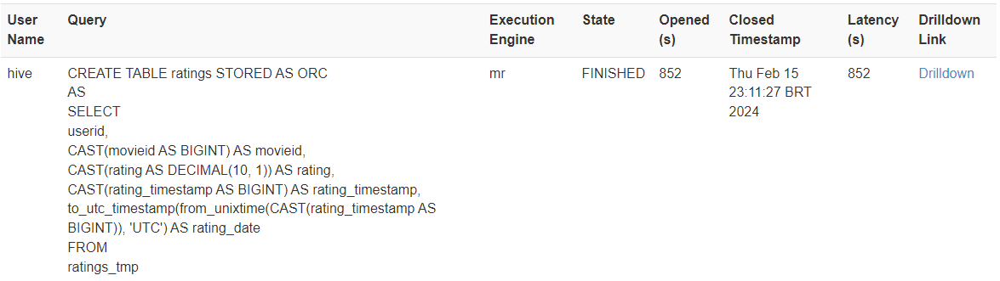</img>
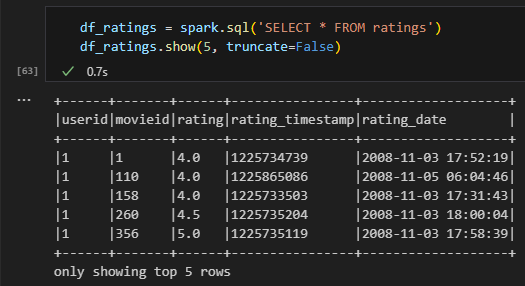</img>

## Análise de dados dos filmes
### Variação nas classificações ao longo do tempo
A análise dos dados do gráfico de linha para o filme **Fight Club (1999)** sugere que, ao longo do tempo, a média das classificações dos usuários tende a aumentar. Isso pode ser interpretado como um indicativo de que o filme tem ganhado reconhecimento e apreciação ao longo dos anos, indicando uma possível ascensão para o status de filme cult.
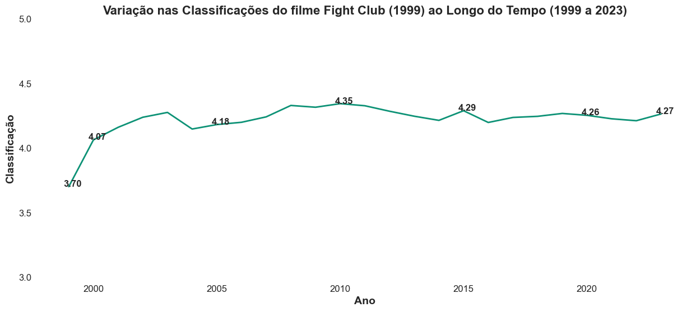</img>

O filme **Central do Brasil** (1998) parece ter tido uma recepção inicial muito positiva em 1999, com uma média de 4.24, indicando um forte impacto emocional ou apreciação do público.<br>

**Central do Brasil** é um filme brasileiro dirigido por Walter Salles, estrelado por Fernanda Montenegro e Vinícius de Oliveira. Lançado em 1998, o filme foi indicado ao Oscar de Melhor Filme Estrangeiro e recebeu aclamação da crítica por suas performances, direção e narrativa poética.
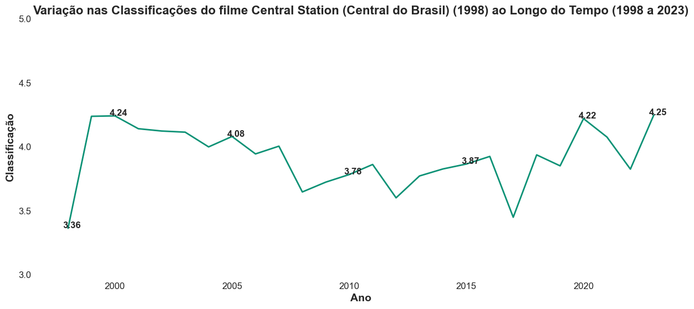</img>

### Análise de frequência de tags
**Período de 1981 a 1990**<br>
As palavras "original," "weird," e "comedy" sugerem um foco na originalidade e em gêneros cinematográficos distintos. A presença de "horror" indica uma inclinação para filmes de terror, enquanto "violence" e "action" sugerem uma preferência por elementos mais intensos e dinâmicos.
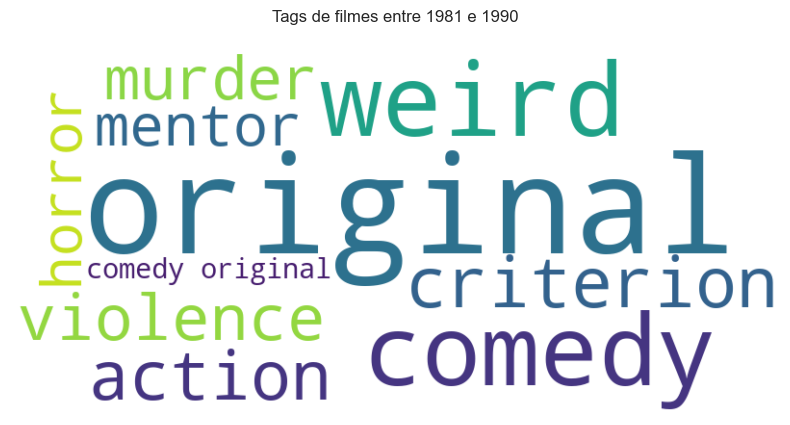</img>

**Período de 1921 a 2024**<br>
A inclusão de "visually appealing" sugere uma valorização da estética visual, enquanto a menção de "good soundtrack" destaca a importância da trilha sonora, indicando um reconhecimento do papel significativo da música na experiência cinematográfica.
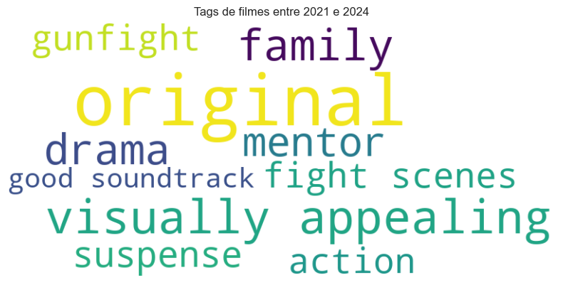</img>

### Distribuição de gêneros de filmes
O **Drama é o gênero mais prevalente**, representando a maior quantidade de filmes no conjunto de dados. Essa predominância sugere a popularidade contínua de dramas ao longo dos anos e destaca seu apelo amplo ao público.<br>

Gêneros menos comuns, como **Film-Noir e IMAX**, têm representações menores. Isso sugere que esses gêneros são mais específicos e podem atrair um público de nicho, indicando uma abordagem mais seletiva na produção desses filmes.
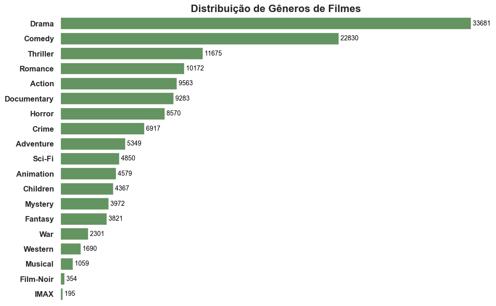</img>

**Comedy e Drama** são os gêneros mais consistentes ao longo das décadas. A presença significativa desses gêneros é observada desde as décadas mais antigas até as mais recentes, destacando sua popularidade contínua.
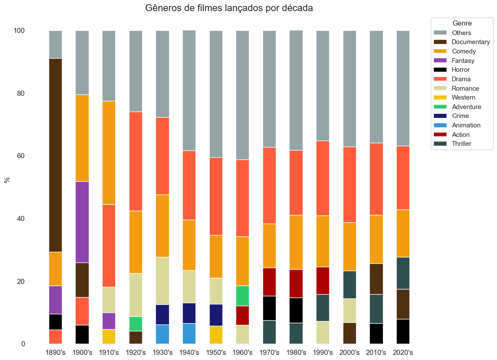</img>

### Classificações para diferentes gêneros de filmes
**Film-Noir:** Com uma classificação de 3.92, Film-Noir é o gênero com a classificação mais alta na lista. Isso sugere que os filmes classificados como Film-Noir são geralmente bem recebidos pelos espectadores, indicando uma apreciação significativa por esse tipo de filme.<br>

**War:** Logo abaixo, War possui uma classificação de 3.80, a segunda mais alta. Isso indica que os filmes de guerra também são bem avaliados pelos espectadores, sugerindo uma forte recepção para esse gênero.<br>

**Horror:** Com uma classificação de 3.31, é o gênero com a classificação mais baixa. Isso sugere que os filmes de horror podem não ser tão bem recebidos em comparação com outros gêneros listados. Os espectadores tendem a dar pontuações mais baixas para filmes de horror, indicando uma recepção menos favorável para esse tipo de filme.

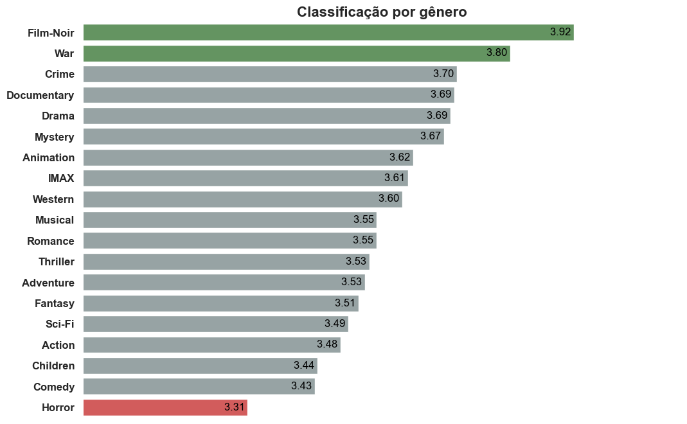</img>

## Implementação do algoritmo ALS
O modelo ALS será treinado apenas com filmes que têm mais de **100 avaliações**. Isso pode ser importante para garantir que os filmes usados no treinamento do modelo tenham recebido um número suficiente de avaliações para gerar recomendações mais robustas e significativas.

Os números fornecidos indicam a distribuição do número de avaliações para os filmes:

- O dataset contém **83.239** filmes.
- **17.916** filmes contêm apenas 1 avaliação.
- **10.161** filmes contêm apenas 2 avaliações.
- **55.162** filmes contêm 3 avaliações ou mais.
- **43.873** filmes contêm 5 avaliações ou mais.
- **32.021** filmes contêm 10 avaliações ou mais.
- **16.116** filmes contém 50 avaliações ou mais.
- **12.253** filmes contêm 100 avaliações ou mais.
- **6.929** filmes contêm mais avaliações do que a média (406).

### Realizando a Hiperparametrização do modelo ALS
Considerando que os ratings variam de 0 a 5, o Root Mean Square Error (RMSE) de **0.809221** indica que, em média, as previsões do modelo têm uma discrepância de aproximadamente 0.809221 unidades em relação aos valores reais em uma escala de 0 a 5.

Root Mean Squared Error (RMSE) on test data = 0.809221<br>
Rank = 20<br>
MaxIter = 15<br>
RegParam = 0.1<br>

### Recomendando filmes

Irei passar ao modelo minhas avaliações pessoais dos filmes assistidos por mim (Vinicius Luiz). Ao todo, foram **115 filmes** avaliados.
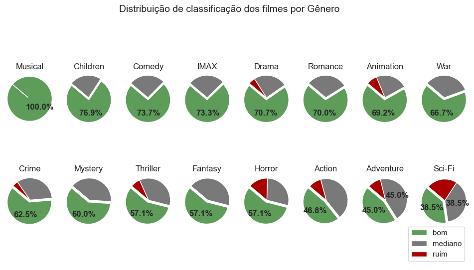</img>

#### Geral
Treinando o modelo com todas as avaliações disponíveis, esse foi os filmes recomendados para mim:

| movieid | title                                    | rating | genres                                                |
|---------|------------------------------------------|--------|-------------------------------------------------------|
| 2959    | Fight Club (1999)                         | 4.3    | [Action, Crime, Drama, Thriller]                       |
| 3761    | Blood In, Blood Out (1993)                | 4.3    | [Action, Crime, Drama, Thriller]                       |
| 176601  | Black Mirror                              | 4.3    | [(no genres listed)]                                   |
| 179053  | 2048: Nowhere to Run (2017)               | 4.3    | [Sci-Fi, Thriller]                                     |
| 170705  | Band of Brothers (2001)                   | 4.2    | [Action, Drama, War]                                   |
| 47      | Seven (a.k.a. Se7en) (1995)               | 4.2    | [Mystery, Thriller]                                    |
| 109487  | Interstellar (2014)                       | 4.2    | [Sci-Fi, IMAX]                                         |
| 231701  | Kill Bill: The Whole Bloody Affair (2011) | 4.2    | [Action, Crime]                                        |
| 27022   | Thursday (1998)                           | 4.2    | [Action, Crime, Thriller]                              |
| 79132   | Inception (2010)                          | 4.2    | [Action, Crime, Drama, Mystery, Sci-Fi, Thriller, IMAX]|
| 121374  | Bill Burr: Why Do I Do This? (2008)       | 4.2    | [Comedy]                                               |
| 74458   | Shutter Island (2010)                     | 4.2    | [Drama, Mystery, Thriller]                             |
| 71838   | Law Abiding Citizen (2009)                | 4.2    | [Drama, Thriller]                                      |
| 106782  | The Wolf of Wall Street (2013)            | 4.2    | [Comedy, Crime, Drama]                                 |
| 182723  | Cosmos: A Spacetime Odissey               | 4.2    | [(no genres listed)]                                   |
| 220528  | Twelve Angry Men (1954)                   | 4.1    | [Drama]                                                |
| 48516   | The Departed (2006)                       | 4.1    | [Crime, Drama, Thriller]                               |
| 4011    | Snatch (2000)                             | 4.1    | [Comedy, Crime, Thriller]                              |
| 6187    | The Life of David Gale (2003)             | 4.1    | [Crime, Drama, Thriller]                               |
| 181267  | Perfectos desconocidos (2017)             | 4.1    | [Comedy, Drama]                                        |

#### Filmes de animação-comédia para crianças

Treinando o modelo com filmes de gênero animação-comédia para crianças, esse foi os filmes recomendados para mim:

| movieid | title                                       | rating | genres                                                  |
|---------|---------------------------------------------|--------|--------------------------------------------------------|
| 134853  | Inside Out (2015)                           | 0.5    | [Adventure, Animation, Children, Comedy, Drama, Fantasy]|
| 1       | Toy Story (1995)                            | 0.5    | [Adventure, Animation, Children, Comedy, Fantasy]       |
| 78499   | Toy Story 3 (2010)                          | 0.5    | [Adventure, Animation, Children, Comedy, Fantasy, IMAX] |
| 134849  | Duck Amuck (1953)                           | 0.5    | [Animation, Children, Comedy]                           |
| 3114    | Toy Story 2 (1999)                          | 0.5    | [Adventure, Animation, Children, Comedy, Fantasy]       |
| 163066  | Rabbit Seasoning (1952)                     | 0.5    | [Animation, Children, Comedy]                           |
| 6377    | Finding Nemo (2003)                         | 0.5    | [Adventure, Animation, Children, Comedy]                |
| 4886    | Monsters, Inc. (2001)                       | 0.5    | [Adventure, Animation, Children, Comedy, Fantasy]       |
| 95311   | Presto (2008)                               | 0.4    | [Animation, Children, Comedy, Fantasy]                  |
| 225173  | Soul (2020)                                 | 0.4    | [Adventure, Animation, Children, Comedy, Fantasy]       |
| 136477  | One Froggy Evening (1955)                   | 0.4    | [Animation, Children, Comedy]                           |
| 135867  | Rabbit Fire (1951)                          | 0.4    | [Animation, Children, Comedy]                           |
| 167792  | What's Opera, Doc? (1957)                   | 0.4    | [Animation, Children, Comedy]                           |
| 95858   | For the Birds (2000)                        | 0.4    | [Animation, Children, Comedy]                           |
| 138702  | Feast (2014)                                | 0.4    | [Animation, Children, Comedy, Drama, Romance]           |
| 72356   | Partly Cloudy (2009)                        | 0.4    | [Animation, Children, Comedy, Fantasy]                  |
| 8961    | The Incredibles (2004)                      | 0.4    | [Action, Adventure, Animation, Children, Comedy]        |
| 201588  | Toy Story 4 (2019)                          | 0.4    | [Adventure, Animation, Children, Comedy]                |
| 178827  | Paddington 2 (2017)                         | 0.4    | [Adventure, Animation, Children, Comedy]                |
| 1148    | Wallace & Gromit: The Wrong Trousers (1993) | 0.4    | [Animation, Children, Comedy, Crime]                    |

#### Filmes para quem gostou de Velozes e Furiosos
Treinando o modelo com avaliações dos usuários que classificaram como "bom" a saga Velozes e Furiosos, esse foi os filmes recomendados para mim:

| movieid | title                                                                                | rating | genres                           |
|---------|--------------------------------------------------------------------------------------|--------|----------------------------------|
| 1365    | Ridicule (1996)                                                                      | 5.0    | [Drama]                          |
| 103017  | The Body (2012)                                                                      | 4.9    | [Mystery, Thriller]              |
| 33649   | Saving Face (2004)                                                                   | 4.9    | [Comedy, Drama, Romance]         |
| 4547    | Stormy Monday (1988)                                                                 | 4.8    | [Crime, Drama]                   |
| 7562    | Dobermann (1997)                                                                     | 4.7    | [Action, Crime]                  |
| 284291  | Tetris (2023)                                                                        | 4.7    | [Drama]                          |
| 147300  | Adventures Of Sherlock Holmes And Dr. Watson: The Twentieth Century Approaches (1986) | 4.7    | [Crime, Mystery]                 |
| 68486   | Red Cliff Part II (Chi Bi Xia: Jue Zhan Tian Xia) (2009)                             | 4.6    | [Action, Drama, War]             |
| 131433  | Confession of Murder (2012)                                                          | 4.6    | [Action, Thriller]               |
| 6148    | White Dog (1982)                                                                     | 4.6    | [Drama, Horror, Thriller]        |
| 47394   | Bon Cop, Bad Cop (2006)                                                              | 4.6    | [Action, Comedy, Crime, Thriller]|
| 6329    | Manic (2001)                                                                         | 4.5    | [Drama]                          |
| 96020   | Sidewalls (Medianeras) (2011)                                                        | 4.5    | [Drama]                          |
| 50651   | Kenny (2006)                                                                         | 4.5    | [Comedy]                         |
| 147326  | The Adventures of Sherlock Holmes and Doctor Watson: King of Blackmailers (1980)     | 4.5    | [Crime, Mystery]                 |
| 8485    | Samsara (2001)                                                                       | 4.5    | [Adventure, Drama, Romance]      |
| 1415    | Thieves (Voleurs, Les) (1996)                                                        | 4.5    | [Crime, Drama, Romance]          |
| 207638  | La belle époque (2019)                                                               | 4.5    | [Comedy, Drama]                  |
| 220528  | Twelve Angry Men (1954)                                                              | 4.5    | [Drama]                          |
| 1757    | Fallen Angels (Duo luo tian shi) (1995)                                              | 4.4    | [Drama, Romance]                 |


### Referências e Links úteis
- *Apache Hive: https://www.databricks.com/br/glossary/apache-hive*<br>
- *Pyspark: https://www.databricks.com/br/glossary/pyspark*<br>
- *ALS: https://towardsdatascience.com/prototyping-a-recommender-system-step-by-step-part-2-alternating-least-square-als-matrix-4a76c58714a1*<br>
- *Curso de Ecossistema Hadoop: https://www.udemy.com/course/construindo-big-data-com-cluster-de-hadoop-e-ecossistema/*<br>
- *Utilizando Pyspark com Hive: https://sparkbyexamples.com/apache-hive/pyspark-sql-read-hive-table/*
- *Alterando configuração de uso de memória do PySpark: https://stackoverflow.com/questions/32336915/pyspark-java-lang-outofmemoryerror-java-heap-space*