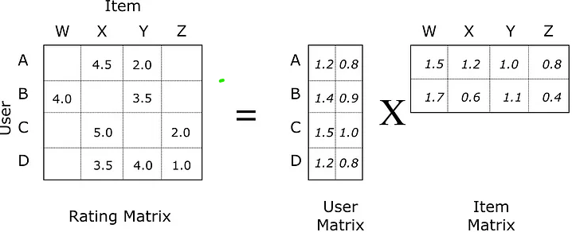

# movie_recommendation_pyspark
Desenvolvendo uma engine de recomendação de filmes com ALS - PySpark

## Índice
- Descrição da base de dados
- Tecnologias utilizadas
- Desafios do projeto
- Armazenamento dos dados no HDFS
- Análise de dados dos filmes
- Implementação do algoritmo ALS

## Descrição da base de dados
A base de dados ml-latest descreve a atividade de classificação de 5 estrelas e aplicação de tags de texto livre do MovieLens, um serviço de recomendação de filmes. Ela contém 33.832.162 classificações e 2.328.315 aplicações de tags em 86.537 filmes. Esses dados foram criados por 330.975 usuários entre 9 de janeiro de 1995 e 20 de julho de 2023. A base de dados foi gerada em 20 de julho de 2023.

A base de dados inclui arquivos como `ratings.csv`, `tags.csv`, `movies.csv`, `links.csv`, `genome-scores.csv` e `genome-tags.csv`. Ela também contém informações sobre a estrutura dos arquivos, como os formatos de dados e as condições de uso.

Além disso, a base de dados ml-latest é uma base de desenvolvimento e não é apropriada para resultados de pesquisa compartilhados. Ela está disponível para download público, mas seu uso está sujeito a condições específicas, incluindo a necessidade de citar a base de dados em publicações resultantes do seu uso.

- **ratings.csv:** Este arquivo contém todas as classificações na base de dados. Cada linha representa uma classificação de um filme por um usuário e tem o seguinte formato: userId, movieId, rating, timestamp. As classificações são feitas em uma escala de 5 estrelas, com incrementos de meio ponto (0,5 estrelas - 5,0 estrelas). Os timestamps representam segundos desde a meia-noite do Tempo Universal Coordenado (UTC) de 1º de janeiro de 1970.

- **tags.csv:** Este arquivo contém todas as tags na base de dados. Cada linha representa uma tag aplicada a um filme por um usuário e tem o seguinte formato: userId, movieId, tag, timestamp. As tags são metadados gerados pelo usuário sobre filmes e geralmente consistem em uma única palavra ou frase curta.

- **movies.csv:** Este arquivo contém informações sobre os filmes na base de dados. Cada linha após a linha de cabeçalho representa um filme e tem o seguinte formato: movieId, title, genres. Os títulos dos filmes incluem o ano de lançamento entre parênteses. Os gêneros são uma lista separada por tubos e são selecionados de uma lista específica.

- **links.csv:** Este arquivo contém identificadores que podem ser usados para vincular a outras fontes de dados de filmes. Cada linha após a linha de cabeçalho representa um filme e tem o seguinte formato: movieId, imdbId, tmdbId. Os identificadores são usados por diferentes provedores de dados de filmes, como MovieLens, IMDb e The Movie Database (TMDb).

- **genome-scores.csv:** Este arquivo contém dados de relevância de tags para filmes. Cada linha representa a relevância de uma tag para um filme e tem o seguinte formato: movieId, tagId, relevance. Esses dados fazem parte do Tag Genome, que codifica quão fortemente os filmes exibem propriedades específicas representadas por tags.

- **genome-tags.csv:** Este arquivo fornece descrições de tags para os IDs de tags no arquivo do Tag Genome. Cada linha após a linha de cabeçalho tem o seguinte formato: tagId, tag. Os valores de tagId são gerados quando o conjunto de dados é exportado, então eles podem variar de uma versão para outra dos conjuntos de dados do MovieLens.

## Tecnologias utilizadas

### HDFS - Hadoop Distributed File System
O HDFS, ou Hadoop Distributed File System, é um sistema de arquivos distribuído desenvolvido para lidar com o armazenamento e processamento eficientes de grandes conjuntos de dados em ambientes de computação distribuída. Projetado como parte integrante do ecossistema Hadoop, o HDFS divide arquivos em blocos de tamanho fixo, distribuindo-os em diversos nós de um cluster. Essa abordagem facilita a leitura e gravação paralelas, possibilitando o processamento eficiente de dados em larga escala. Com mecanismos de replicação para tolerância a falhas, balanceamento dinâmico de carga e integração com ferramentas Hadoop, o HDFS é essencial para operações de big data, suportando aplicações como análise de dados, processamento de logs e outras tarefas intensivas em armazenamento e processamento.

1. **Blocos e Distribuição de Dados:** O HDFS divide grandes arquivos em blocos, geralmente de tamanho fixo (por exemplo, 128 MB ou 256 MB).
2. **Servidores Namenode e Datanode:**
   - O Namenode mantém os metadados, como informações sobre a localização dos blocos e a estrutura do arquivo.
   - Os Datanodes armazenam os blocos de dados e respondem às solicitações de leitura e gravação.
3. **Leitura e Gravação em Paralelo:**
   - O HDFS permite a leitura e gravação eficientes de grandes conjuntos de dados em paralelo.
   - Múltiplos nós podem acessar e processar diferentes partes do arquivo simultaneamente.

</img>

### Hive
O Apache Hive é um software de data warehouse de código aberto projetado para ler, gravar e gerenciar grandes conjuntos de dados extraídos do Apache Hadoop Distributed File System (HDFS), um aspecto de um ecossistema Hadoop maior.

Usamos o Apache Hive quando precisarmos realizar consultas ou manipulações em grandes conjuntos de dados, tais como seleção de registros ou colunas, agregação, sumarização, contagem de elementos, filtros ou atualizações em massa. Essas tarefas não precisam ser feitas em tempo real e o que queremos é obter insights a partir de grande conjuntos de dados, Big Data.

</img>

### Pyspark
PySpark é uma API em Python para executar o Spark e foi lançado para oferecer suporte à colaboração entre Apache Spark e Python. O PySpark também oferece suporte à interface do Apache Spark com conjuntos de dados distribuídos resilientes (RDDs) na linguagem de programação Python. Isso é obtido aproveitando a biblioteca Py4J.

Py4J é uma biblioteca popular incorporada ao PySpark que permite a interface dinâmica com objetos na JVM do Python. O PySpark possui muitas implementações de bibliotecas para programação eficiente e também possui bibliotecas externas compatíveis.

#### PySparkSQL
PySparkSQL é uma biblioteca PySpark para análises semelhantes a SQL em grandes quantidades de dados estruturados e semiestruturados. Você pode usar o PySparkSQL para executar queries SQL, trabalhar com o Apache Hive e até mesmo aplicar o HiveQL.

#### MLlib
MLlib é um wrapper para PySpark e a biblioteca de machine learning (ML) do Spark. Esta biblioteca usa a técnica de paralelismo de dados para armazenar e trabalhar com dados. A API de machine learning fornecida pela biblioteca MLlib é fácil de usar. MLlib é compatível com muitos algoritmos de machine learning para classificação, regressão, agrupamento, filtragem colaborativa, redução de dimensionalidade e primitivas de otimização subjacentes.

### ALS - Alternating Least Squares
O ALS (Alternating Least Squares) em PySpark é um algoritmo de fatoração de matrizes utilizado para sistemas de recomendação. Ele opera através de iterações, aproximando a matriz de classificações R como o produto de duas matrizes inferiores, X e Y. A abordagem iterativa envolve a constante resolução de uma matriz enquanto a outra é mantida fixa. Esta implementação específica utiliza uma abordagem bloqueada, otimizando a comunicação entre conjuntos de fatores ('usuários' e 'itens') por meio de blocos. O ALS é eficaz para dados de preferências implícitas, adaptando-se a uma matriz de preferência P, onde os elementos indicam confiança na preferência do usuário. Em resumo, o ALS é uma ferramenta fundamental para construção de sistemas de recomendação, proporcionando uma abordagem eficiente e escalável para encontrar padrões em grandes conjuntos de dados.

</img>

### Referências
*Apache Hive: https://www.databricks.com/br/glossary/apache-hive*<br>
*Pyspark: https://www.databricks.com/br/glossary/pyspark*<br>
*ALS: https://towardsdatascience.com/prototyping-a-recommender-system-step-by-step-part-2-alternating-least-square-als-matrix-4a76c58714a1*<br>
*Curso de Ecossistema Hadoop: https://www.udemy.com/course/construindo-big-data-com-cluster-de-hadoop-e-ecossistema/*<br>

## Desafios do projeto
<p style="color: blue"><b>TODO</b></p>

## Armazenamento dos dados no HDFS
### Criando tabelas temporárias
Quando utilizarmos o comando LOAD, usaremos o OpenCSVSerde, um SerDe projetado para ler arquivos CSV. SerDe trata-se de uma abreviação para Serializer/Deserializer. O Hive usa a interface SerDe para ler e escrever dados em qualquer formato customizado. OpenCSVSerde trata todas as colunas como String, então irei criar tabelas temporárias e carregar dados nessas tabelas utilizando o OpenCSVSerde, para então converter as colunas das tabelas para os tipos de dados adequados.

```sql
-- Comando LOAD utilizando OpenCSVSerde para ler arquivos CSV.
-- OpenCSVSerde é um SerDe projetado para processar arquivos CSV.

-- Criar tabelas temporárias usando OpenCSVSerde.
CREATE TABLE ratings_tmp (
  userId STRING,
  movieId STRING,
  rating STRING,
  rating_timestamp STRING
) ROW FORMAT SERDE 'org.apache.hadoop.hive.serde2.OpenCSVSerde' TBLPROPERTIES ("skip.header.line.count"="1");

CREATE TABLE movies_tmp (
  movieId STRING,
  title STRING,
  genres STRING
) ROW FORMAT SERDE 'org.apache.hadoop.hive.serde2.OpenCSVSerde' TBLPROPERTIES ("skip.header.line.count"="1");

CREATE TABLE tags_tmp (
  userId  STRING,
  movieId STRING,
  tag     STRING,
  tag_timestamp STRING
) ROW FORMAT SERDE 'org.apache.hadoop.hive.serde2.OpenCSVSerde' TBLPROPERTIES ("skip.header.line.count"="1");

CREATE TABLE links_tmp (
   movieId STRING,
   imbdId  STRING,
   tmdbId  STRING
) ROW FORMAT SERDE 'org.apache.hadoop.hive.serde2.OpenCSVSerde' TBLPROPERTIES ("skip.header.line.count"="1");

CREATE TABLE links_tmp (
   movieId STRING,
   imbdId  STRING,
   tmdbId  STRING
) ROW FORMAT SERDE 'org.apache.hadoop.hive.serde2.OpenCSVSerde' TBLPROPERTIES ("skip.header.line.count"="1");

CREATE TABLE genome_tags_tmp (
   tagId STRING,
   tag   STRING
) ROW FORMAT SERDE 'org.apache.hadoop.hive.serde2.OpenCSVSerde' TBLPROPERTIES ("skip.header.line.count"="1");

CREATE TABLE genome_scores_tmp (
   movieId STRING,
   tagId   STRING,
   relevance   STRING
) ROW FORMAT SERDE 'org.apache.hadoop.hive.serde2.OpenCSVSerde' TBLPROPERTIES ("skip.header.line.count"="1");

-- Carregar dados nas tabelas temporárias usando OpenCSVSerde.
-- OpenCSVSerde trata todas as colunas como String.
-- Posteriormente, as colunas serão convertidas para os tipos de dados adequados.
```

### Carregando tabelas temporárias
```sql
-- Comandos para carregar dados em tabelas temporárias usando o comando LOAD DATA.
-- Carregar dados do arquivo local (não está no HDFS) na tabela temporária

LOAD DATA LOCAL INPATH '/tmp/ml-latest/ratings.csv' OVERWRITE INTO TABLE ratings_tmp;
LOAD DATA LOCAL INPATH '/tmp/ml-latest/movies.csv' OVERWRITE INTO TABLE movies_tmp;
LOAD DATA LOCAL INPATH '/tmp/ml-latest/tags.csv' OVERWRITE INTO TABLE tags_tmp;
LOAD DATA LOCAL INPATH '/tmp/ml-latest/links.csv' OVERWRITE INTO TABLE links_tmp;
LOAD DATA LOCAL INPATH '/tmp/ml-latest/genome-tags.csv' OVERWRITE INTO TABLE genome_tags_tmp;
LOAD DATA LOCAL INPATH '/tmp/ml-latest/genome-scores.csv' OVERWRITE INTO TABLE genome_scores_tmp;
```

### Carregando tabelas finais
Quando examinado os dados, notei que os títulos que contém o caractere vírgula possuem um erro interessante. Por exemplo: o título é armazenado como “American President, The (1995)” em vez de “The American President (1995)”. 

**Criando as tabelas**

Criação de tabelas armazenadas no formato ORC, utilizando dados da tabelas temporárias

```sql
CREATE TABLE movies STORED AS ORC 
AS 
SELECT 
  CAST(movieid AS BIGINT) movieid,  -- Converte a coluna 'movieid' para o tipo BIGINT.
  CASE 
    WHEN title LIKE '%, The %'
    THEN CONCAT('The ', regexp_replace(title, ', The ', ' '))  -- Adiciona "The " ao título que contém ", The ".
    ELSE title 
  END title,  -- Renomeia a coluna 'title'.
  SPLIT(genres, '\\|') AS genres  -- Converte a coluna 'genres' para um array
FROM 
  movies_tmp;
```

```sql
CREATE TABLE ratings STORED AS ORC 
AS 
SELECT 
  userid,  -- Mantém a coluna 'userid'.
  CAST(movieid AS BIGINT) movieid,  -- Converte a coluna 'movieid' para o tipo BIGINT.
  CAST(rating AS DECIMAL) rating,  -- Converte a coluna 'rating' para o tipo DECIMAL.
  CAST(rating_timestamp AS BIGINT) rating_timestamp  -- Converte a coluna 'rating_timestamp' para o tipo BIGINT.
FROM 
  ratings_tmp;
```

```sql
CREATE TABLE tags STORED AS ORC 
AS 
SELECT 
  userid,
  CAST(movieid AS BIGINT) movieid,
  tag,
  CAST(tag_timestamp AS BIGINT) tag_timestamp
FROM 
  tags_tmp;
```

```sql
CREATE TABLE links STORED AS ORC 
AS 
SELECT 
 CAST(movieid AS BIGINT) movieid,
 imbdId,
 tmdbId
FROM 
  links_tmp;
```

```sql
CREATE TABLE genome_tags STORED AS ORC 
AS 
SELECT 
  tagId,
  tag
FROM 
  genome_tags_tmp;
```

```sql
CREATE TABLE genome_scores STORED AS ORC 
AS 
SELECT 
  CAST(movieid AS BIGINT) movieid,
  tagId,
  CAST(relevance AS DECIMAL(10, 5)) relevance
FROM 
  genome_scores_tmp;
```

## Análise de dados dos filmes
<p style="color: blue"><b>TODO</b></p>

## Implementação do algoritmo ALS
<p style="color: blue"><b>TODO</b></p>